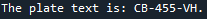

# License plate detection and text extraction using both YOLO and OCR models 

This is a license plate localizer using pre-trained YOLOv5, combined with a text extractor built with a pre-trained TrOCR. 

The functioning is simple: 
- The yolo model localize the plate(s)
- The ROI (Region Of Interest) is cropped
- The TrOCR model is used on the cropped image to extract the text from it

##Usage

###1. Install dependencies

Once you downloaded my repo, set it as your working directory and type in the python console:

    ```bash
    pip install -r requirements.txt
    ```

###2. Use your own images

In the line 25 you have to put the path of the image you want to submit to the models: 

    ```python
    img = 'path/to/your/image'
    ```

##Results

###1. Example of an original image used 


###2. Cropping performed thanks to the Yolo model


###☻3. Text extraction performed by the TrOCR model

